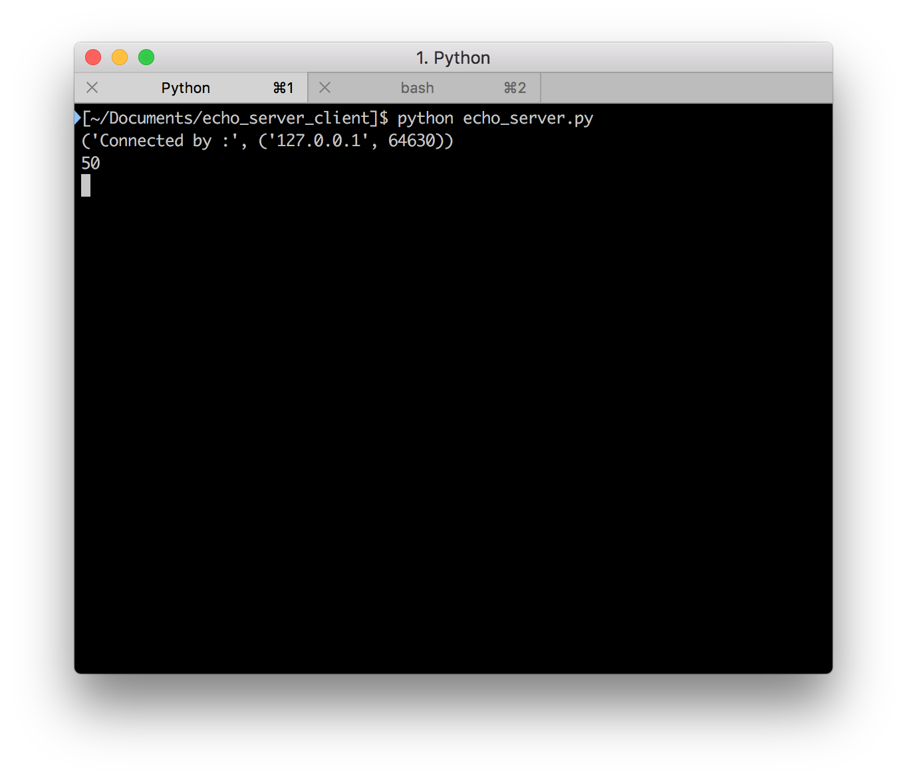
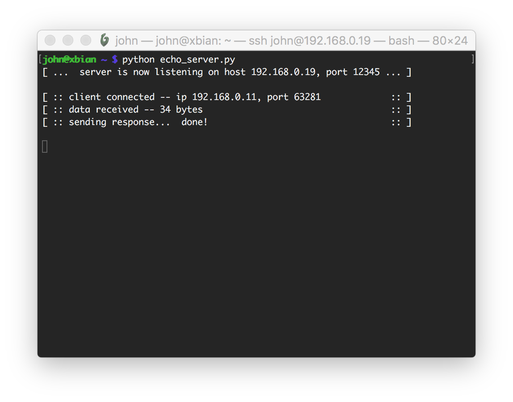
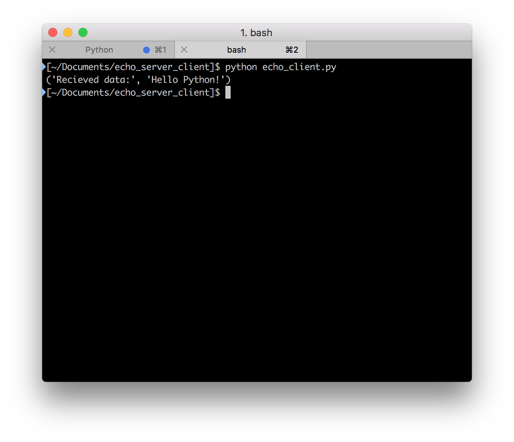
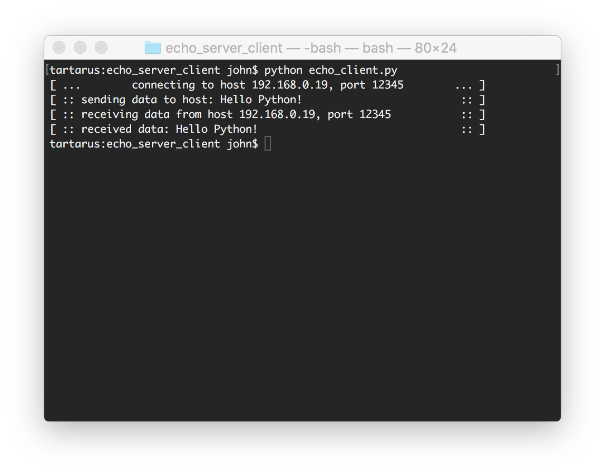

# Echo Server Client

# How it works
It's a basic python program that sends data across the server and the client, in this case being a string

# How to use it
You can use it by starting echo_server.py first and then echo_client.py, in this case you can change the ip address on both to use it
in your own server.

# Screenshots

## Server

## Client

